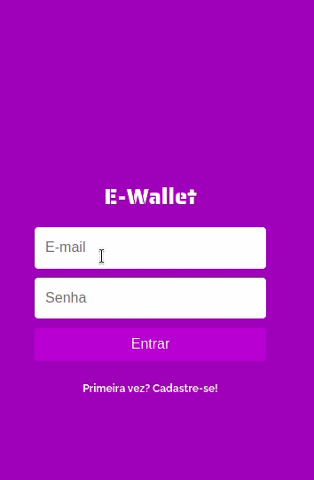

# E-wallet 💸
A helpful tool to control your personal finances 🤑
## Preview 👀
 
#### [Click here and try it now!](https://ewallet-frontend-bfxrctsnu-jotabraga.vercel.app/)
## About 🔎
This is an web aplication wich students can share their old tests and find the one they need.
### Implemented features :heavy_check_mark:
- [x] New income
- [x] New expenses
- [x] Financial balance
- [x] Final value of the balance
### Future improvements 🔮
- [ ] Delete new entrance
- [ ] Edit balance data
- [ ] Month balance chart
- [ ] Investment simulation
## Tech tools 🔧
The following tools and frameworks were used in the construction of the project:<br>
<p>
  
  
  
  
</p>

## How to run ⚙️

1. Clone this repository
2. Install dependencies
```bash
npm i
```
3. Create database using the dump file located in src/database/dump.sql
```bash
psql YOUR_DATABASE_NAME < dump.sql
```
6. You can run the app by
```bash
npm start
```
7. Finally access the front-end on your favorite browser 
